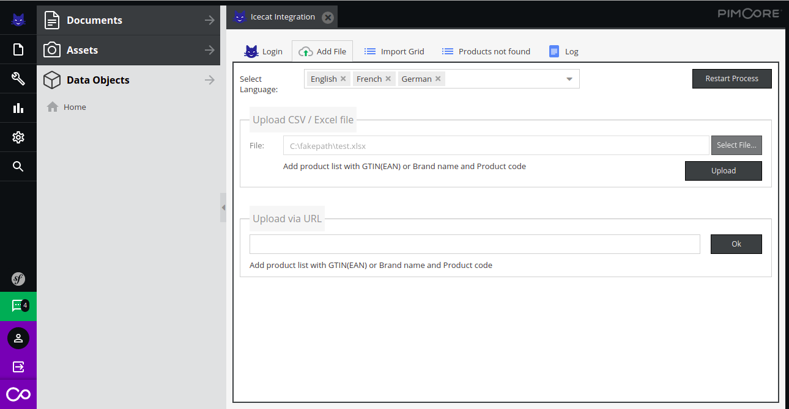
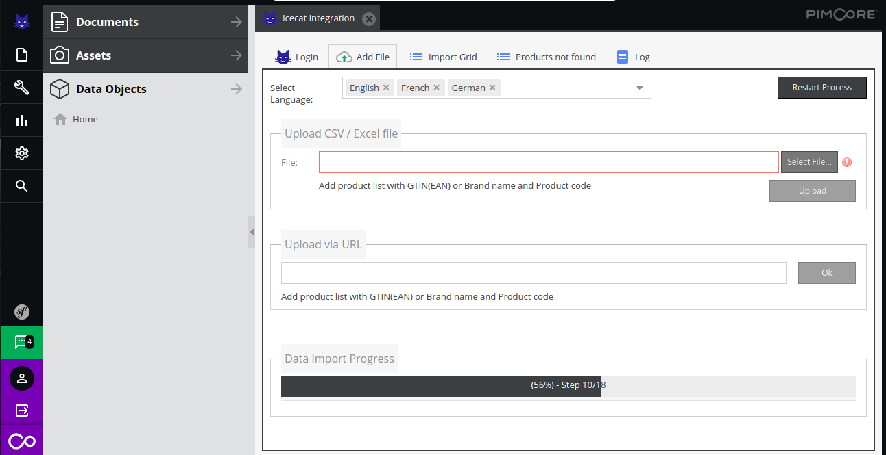
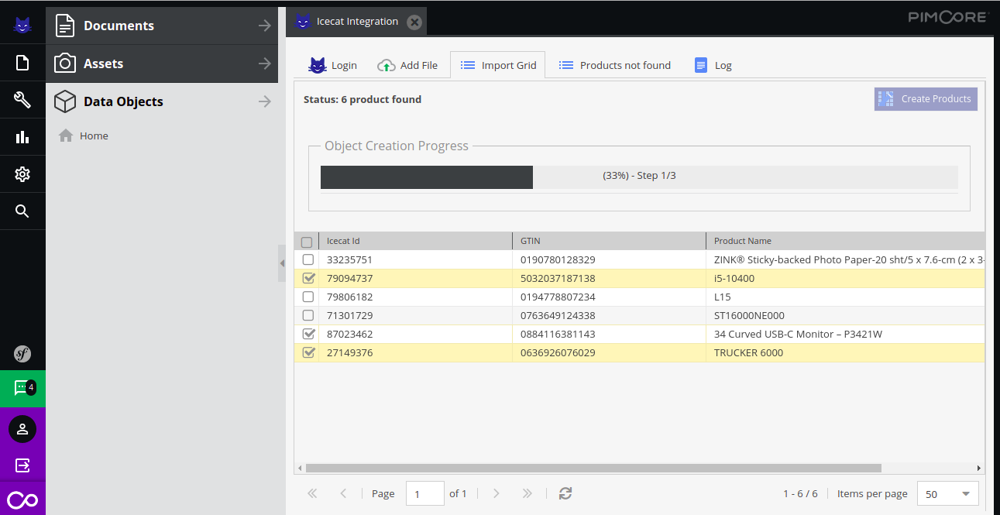
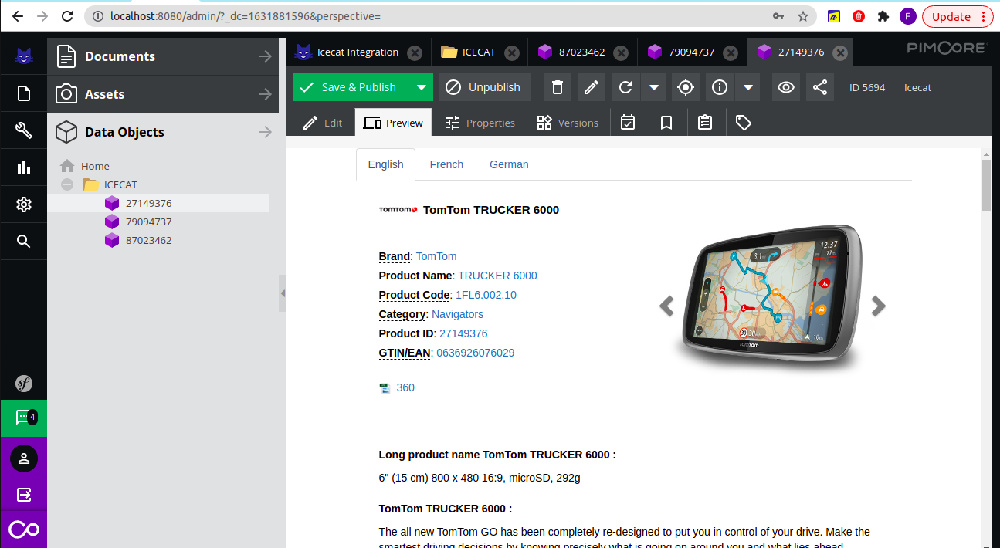
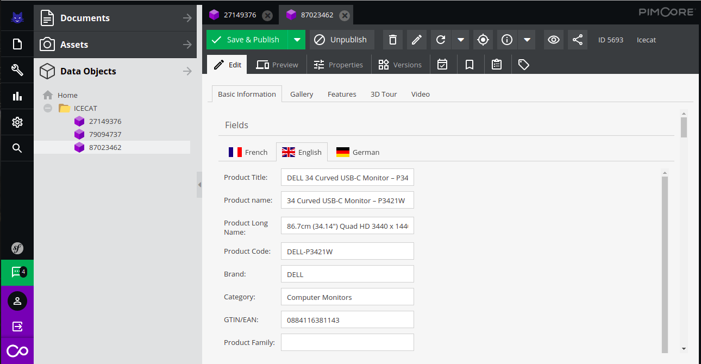
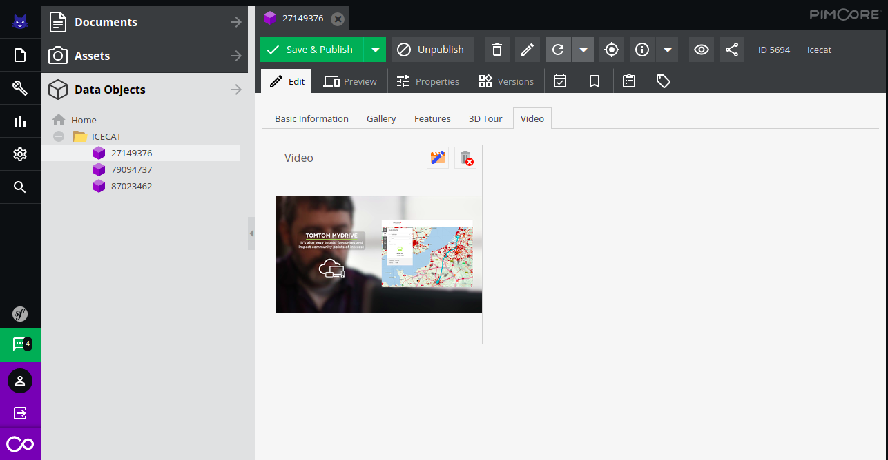
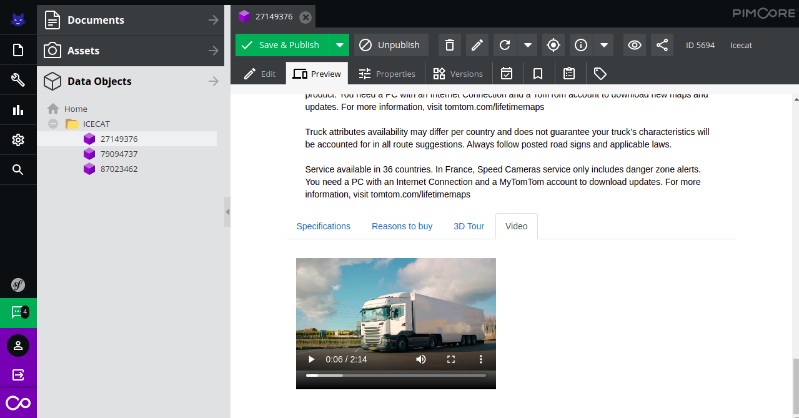
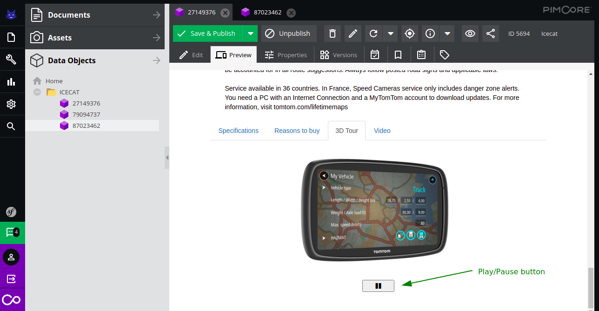
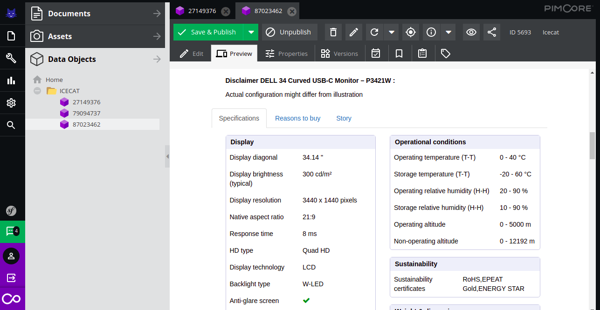

**Icecat Integration plugin**
This extension adds a comprehensive import functionality to Pimcore. It allows importing data from open-Icecat and uses the data to create Pimcore products.

**Installation**
Prerequisites : 
	Pimcore v10.x.x

To install this plugin use following commands:
- Download via composer : composer require icecat/icecat-integration
- Enable the plugin :  bin/console pimcore:bundle:enable IceCatBundle
- Install the plugin: bin/console pimcore:bundle:install IceCatBundle

**Features in a nutshell**
- Configure Import from open-icecat.
- Support file upload : via-url , general-upload.
- Supported File Formats: CSV, XLSX
- Create Products in pimcoreusing imported data.
- Provide Products preview.

**New features in v3.0.0**
- Addition of new fields in import
- Enhanced filtering
- Overwritable fields
- Recurring import as background job
- Single product update

[Click here to see full details for v3.0.0](./doc/plugin_v3.md)

**New features in v2.0.0**
- Enable / Disable automatic Icecat product categorization leading in the Pimcore database
- Filtering products by language / category / brand / searchable attributes
- Improve user experience in v1 features
- Bug fixes / incorporate feedbacks provide by open source community 
- Code compliant with PHP-CS fixer rules provided under php_cs.dist file

[Click here to see full details for v2.0.0](./doc/plugin_v2.md)

**Steps to use :**
1. After successful installation, you can see the icecat integration logo in your pimcore panel.
2. You can open the icecat integration panel by clicking on it .
3. You will need to authenticate yourself by providing open-icecat account credentials.
    
4. If the login is successful, you will see the below tab otherwise you will see the error message on the login tab.
    

**Here, you can :**
- Select Language in which you need to fetch the icecat product data.You can select multiple languages (Languages that are enabled in your pimcore backend will be available here).
If the languages are subscribed in your open icecat account and the languages are available in Pimcore then you can see multiple languages data.

- File upload can be done using a url or  from a file(formats accepted: Excel and Csv)
**Note : File should contain column with name(Product code and Brand Name) or (GTIN/EAN ) , file can contain all these column together also**
- As you hit the upload button, the import process will start and you will be able to see the Import Progress.

5. After importing data, you will see a tab with all found products , you can select the product and click the Create Products button in order to create Pimcore Products .

As the Product Creation starts, a progress bar will appear

6. Once the creation is completed, You can find the Products in the ‘ICECAT’ folder.
7. Now you can open the Products and see the preview,you can also edit the Products

You can edit the product in Pimcore Dataobject’s ICECAT folder.

8. Once the Pimcore products creation process is completed, You can upload a new file and fetch data.

**Pimcore product’s content**
Some major data sections of the products created are:-
- **Video** : User can see the video  in edit section and also in product’s preview section
    - **Video in edit section**

    - **Video in preview section**

**Note: Video preview is available in edit section , if only the FFMPEG extension or any pimcore supported video player is installed on server **
- **Story**: Product story can be seen also, in a rich html format.
    
- **3d Tour**: Some products may also contain a 3D view, which can be seen in the product’s preview.
     
The play pause button can be use to play or pause the 3d animation 
- **Specification**: It contains the dynamic specification of the product , which can vary product wise.

**Note: Some extra functionality** :
- You can restart the process , By clicking the Restart Process button that is available on the file upload panel .You may need to restart the process in following condition
    1. Upload File or any other functionality is not working .
    2. You have imported data using a file but you don't want to create the products.
- You can check the log information in the Log Panel Tab
- You can get the information about those products in the Products not found Tab, that were not fetched during the import process.

	
