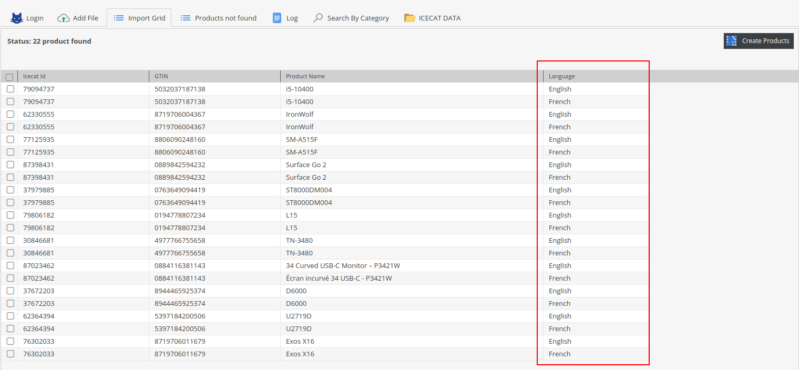
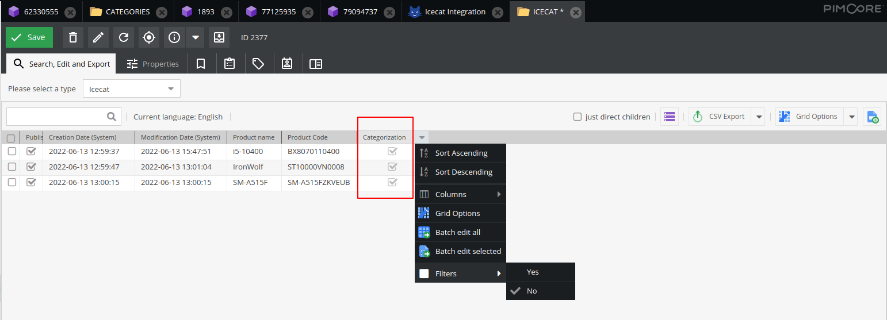
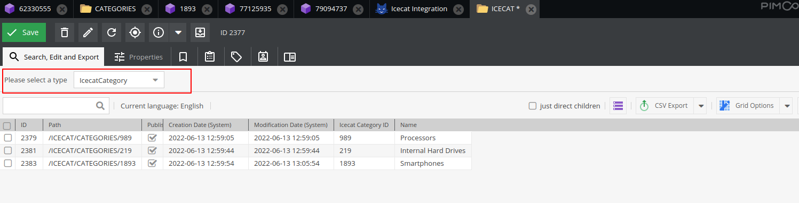
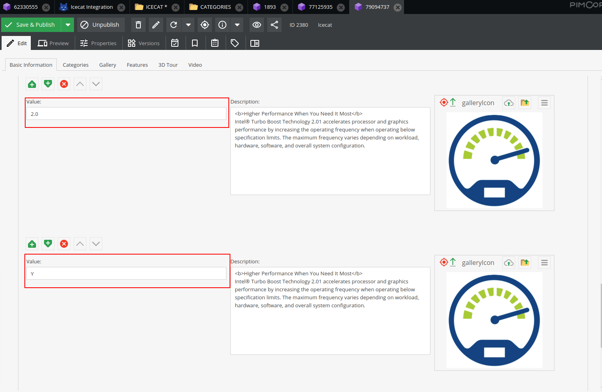

**Icecat plugin v2.0.0**

**Install latest version**

~~~~~~~~~~~~~~~~~~~~~
$ composer require icecat/icecat-integration:2.0.0
~~~~~~~~~~~~~~~~~~~~~

**Update existing icecat plugin**

~~~~~~~~~~~~~~~~~~~~~
$ composer require icecat/icecat-integration:2.0.0
$ bin/console doctrine:migrations:migrate --prefix=IceCatBundle\\Migrations
~~~~~~~~~~~~~~~~~~~~~

**New features listing**

**Enable / Disable automatic Icecat product categorization leading in the Pimcore database**

Checkbox has been added to switch on / off Icecat product categorization.

If icecat categorization is switched on, it will create a master list of categories (IcecatCategory class objects) and attach them to products.

Category objects are created under ICECAT/CATEGORIES folder.

Category object contains Icecat category internal ID and localized name.

In icecat product class, a new field is added for categories which holds the relationship between product and category.

**Search By Category**

A new filter screen is added under icecat panel which shows when Pimcore contains atleast one IcecatCategory class object. The purpose of this screen is to allow users to filter Icecat products by language / category / brands / searchable attributes. 

When importing categories from Icecat, system gets the information what are the searchable attributes configured for that category. Pimcore stores that information and on search screen when category is changed, based on the attributes configured, it creates the search filters on the fly.

Filtered products shows on the right side of the panel.

**Improve user experience**

Added a language column on the import screen to see which products are available in which languages.

User can filter from grid which products have Icecat categories linked.

Category listing on the Icecat category grid.

**Others**

- Bug fixes of v1.0.0 - A new column value has been added in Gallery icons block to view difference between icons. 

- Removed non production code (debug code).
- Code compliant with PHP-CS fixer rules provided under php_cs.dist file.