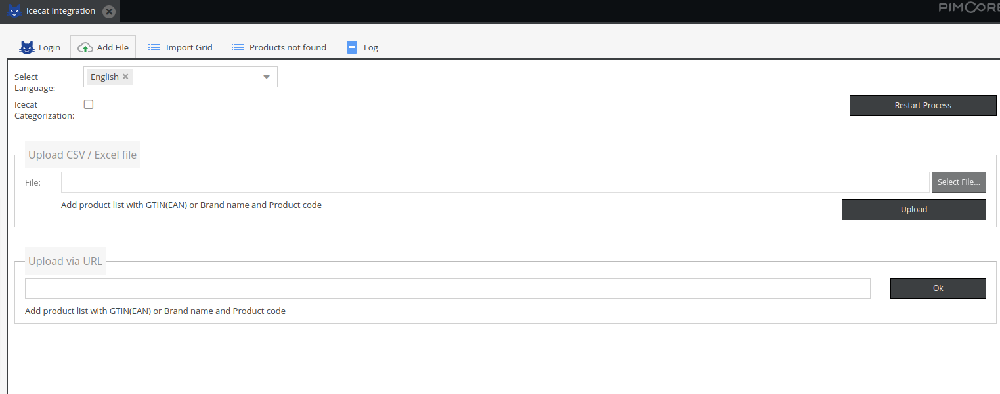
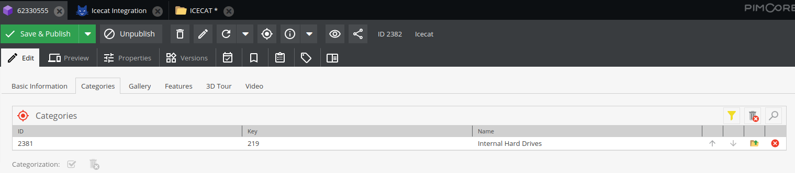
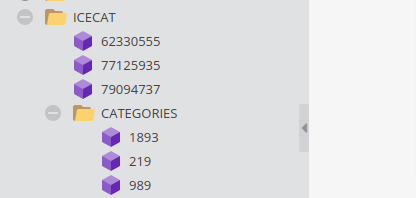
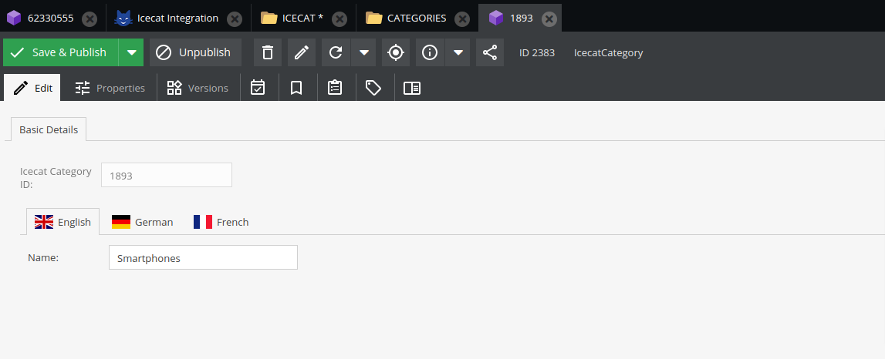
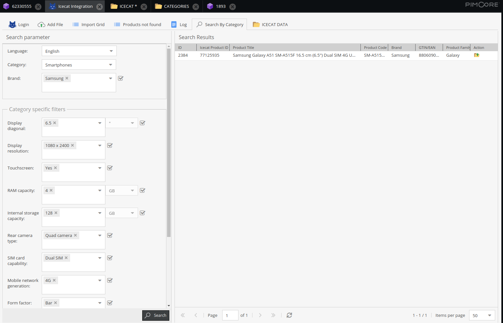

**Icecat plugin v2.0.0**

**Install latest version**

~~~~~~~~~~~~~~~~~~~~~
$ composer require icecat/icecat-integration:2.0.0
~~~~~~~~~~~~~~~~~~~~~

**Update existing icecat plugin**

~~~~~~~~~~~~~~~~~~~~~
$ composer update icecat/icecat-integration:2.0.0
$ bin/console doctrine:migrations:migrate --prefix=IceCatBundle\\Migrations
~~~~~~~~~~~~~~~~~~~~~

**New features listing**

**Automatic product categorization**

A flag has been added on the icecat screen to on / off categorization. If import is done with categorization on, it will create a master list of categories (IcecatCategory class objects) and attach them to products.

Below screenshot shows from where to on / off categorization.

In icecat product class, a new field is added for categories which holds the relationship between product and category.

Category objects are created under ICECAT/CATEGORIES folder.

Category object contains Icecat category internal ID and localized name.

**Search screen**

A new search screen is added under icecat panel which shows when system contains atleast one IcecatCategory class object. The purpose of this screen is to allow users to search Icecat products by category / brands / attributes. 

When importing categories from Icecat, system gets the information what are the searchable attributes configured for that category. Pimcore stores that information and on search screen when category is changed, based on the attributes configured, it creates the search filters on the fly.

Filtered products shows on the right side of the panel.

**Others**
- Bug fixes of v1.0.0
- Imporved code quality

