## Icecat plugin v3.0.0

The v3.0.0 plugin version is compatible with Pimcore version 10.2.* or lower versions.

**Install latest version**

~~~~~~~~~~~~~~~~~~~~~
$ composer require icecat/icecat-integration:^3.0
~~~~~~~~~~~~~~~~~~~~~

**Update existing icecat plugin**

~~~~~~~~~~~~~~~~~~~~~
$ composer require icecat/icecat-integration:^3.0
$ bin/console doctrine:migrations:migrate --prefix=IceCatBundle\\Migrations
~~~~~~~~~~~~~~~~~~~~~

**Prerequisite for the scheduled job**

Set the following command to the crontab
```bash
*/1 * * * * /your/project/bin/console icecat:recurring-import
```
The cron job has to run as the same user as the web interface to avoid permission issues (eg. `www-data`).

## New features listing

**Helpul Icecat links on the login screen**

User will be able to easily navigate to Icecat's registration, forgot password and contact us pages.

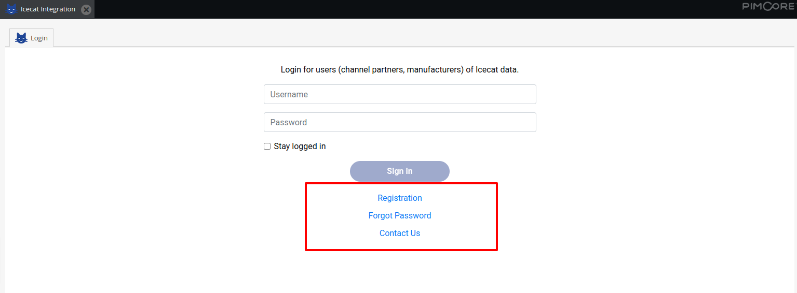

**Addition of more enriched content**

<ins>Product Reviews</ins>

Icecat multilingual product reviews are now part of the import process. 

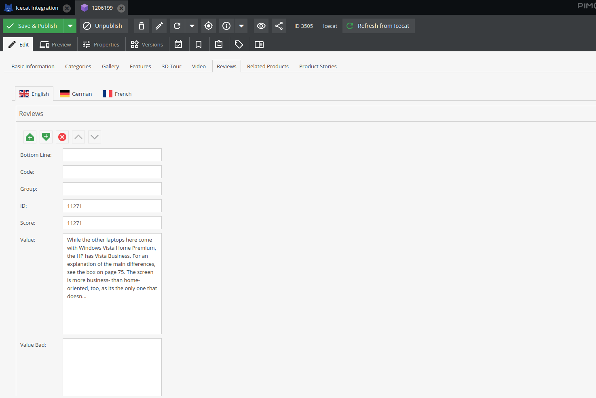

<ins>Product Stories</ins>

Icecat multilingual products stories URL(s) are now part of the import process with the preview.

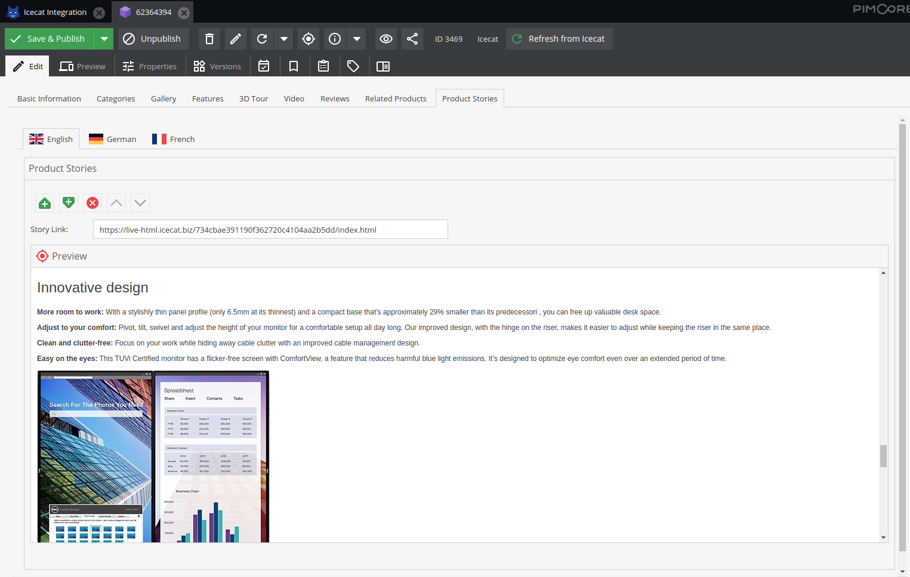

<ins>Videos</ins>

Video field is changed from type video to many to many relation. This is done to enable the import process to download and attach multiple videos. 

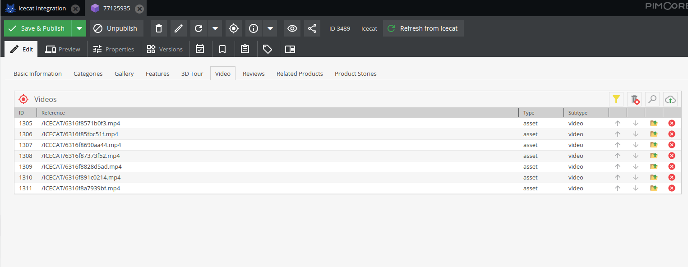

<ins>Related Products</ins>

Related products are now part of the import process. To create related products on the fly, user has an option to enable 'Import Related Products' setting.

Once enabled, if the related products not already exists in the Pimcore, it will first import the related products and then attaches them to the main product.

If disabled, it will check if the related products already exists in the Pimcore, if yes, it will then attach to the main product.

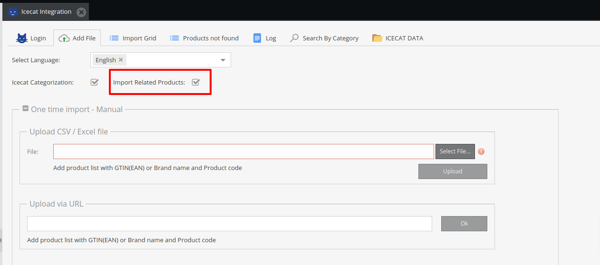

Related products overview.

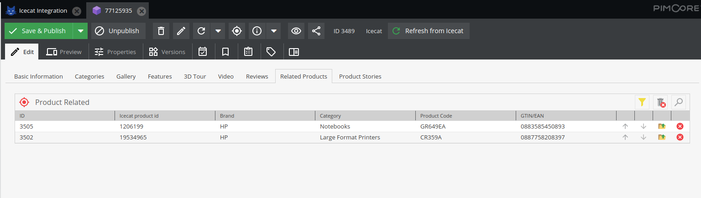


**Advanced filter options**

Additional filters are now available to enable user to search for the required products more easily and efficiently. 

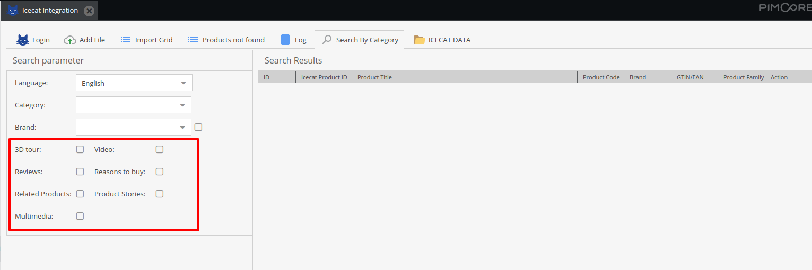


**Overwritable fields - on the fly**

User has the ability to not overwrite product fields while (re)importing products from Icecat.

Whenever user makes any changes locally in the Pimcore products, changes automatically get recorded in 'Icecat overwritten fields log' folder. These fields will not be overwritten while (re)importing.

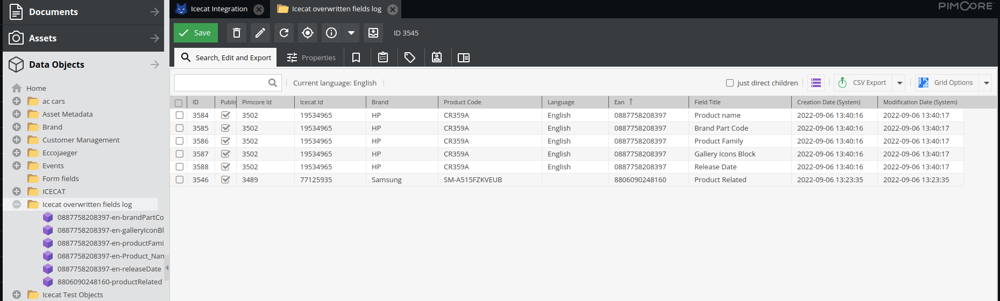

In order to make those fields again overwritable, simply delete the required log entries from the 'Icecat overwritten fields log' folder.

**Single product import**

User has the ability to refresh single product from Icecat using the button placed on the object toolbar.

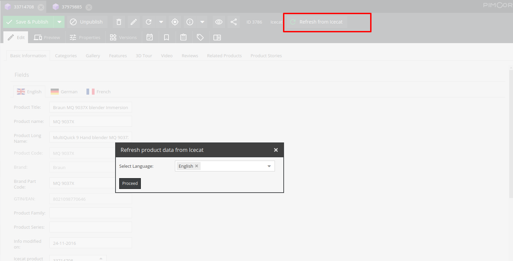

**Recurring bulk import - on demand and scheduled**

<ins>Prerequisite: Set the following command to the crontab</ins>

*/1 * * * * /your/project/bin/console icecat:recurring-import

User has the ability to :- 

- Schedule automated recurring imports from excel file or directly from Pimcore product catalog
- On demand imports

User can attach excel file from Assets section or map product catalog fields which are required to fetch data from Icecat.

A detailed summary of the last completed job will be visible when the job finishes.

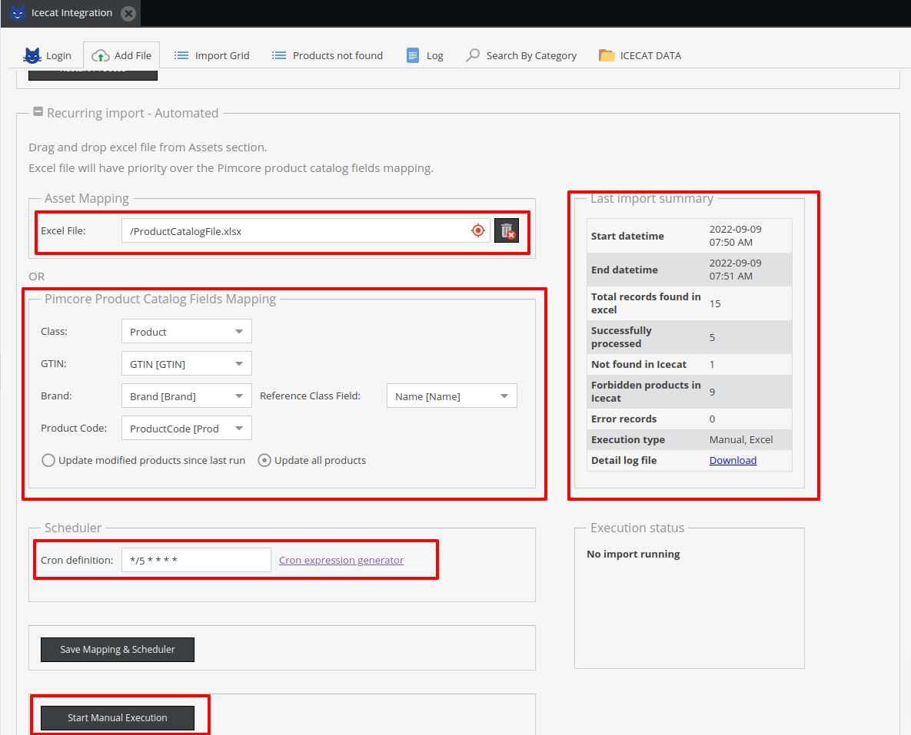

User can cancel the job anytime using 'Cancel execution' button.

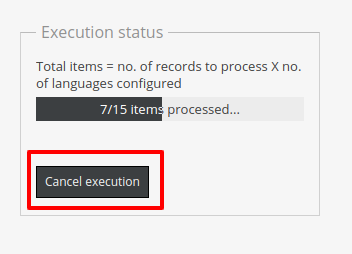
