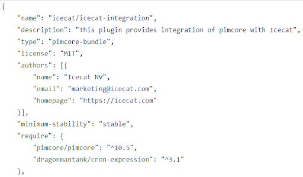
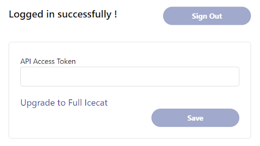
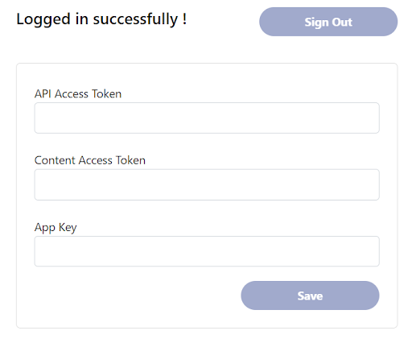
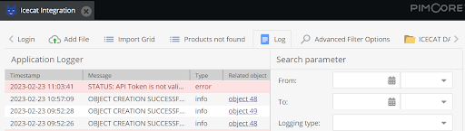
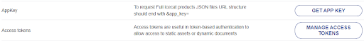

## Icecat plugin v4.0.0

The v4.0.0 addon version is compatible with Pimcore version greater than or equal to 10.5

**Install latest version**

~~~~~~~~~~~~~~~~~~~~~
$ composer require icecat/icecat-integration:^4.0
~~~~~~~~~~~~~~~~~~~~~

**Update existing icecat plugin**

~~~~~~~~~~~~~~~~~~~~~
$ composer require icecat/icecat-integration:^4.0
$ bin/console doctrine:migrations:migrate --prefix=IceCatBundle\\Migrations
~~~~~~~~~~~~~~~~~~~~~

**Prerequisite for the scheduled job**

Set the following command to the crontab
```bash
*/1 * * * * /your/project/bin/console icecat:recurring-import
```
The cron job has to run as the same user as the web interface to avoid permission issues (eg. `www-data`).

## New features listing

**MIT license And Contact Details**



**Unlock the Full Icecat users**

Login as an Open Icecat user
The open icecat user will have to enter the following:
* API Access Token

Upgrade to Full Icecat link will be visible to only open icecat users.



Login as a Full Icecat user
The full icecat user will have to enter the following:
* API Access Token
* Content Access Token 
* App Key

If the user does not enter Content Access Token and App Key, the user will be able to continue getting the open icecat products contents.



Incase of any issues with the user account, the appropriate errors will be logged in the Log and the import process will be stopped without importing any products from the Icecat.



User could get the API Access Token, Content Access Token and App Key details under My Profile by logging into https://icecat.biz 




